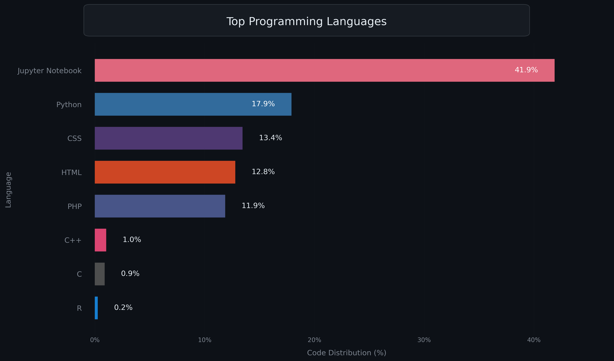

Hi, My name is Pranav Bairy
====================================================================================================================================

Student and a Machine learning developer in training
----------------------------------------------------

I've been learning to code for 2 years, and my most used and favorite languages are Python and C. I usually start coding in Python and then try to optimize it in C. I'm still in the learning phase, and concepts like OOP and DSA are relatively new to me.

*   I'm based in Hyderabad, India
*   You can contact me at [pranavbairy2@gmail.com](mailto:pranavbairy2@gmail.com)
*   I'm currently working on [machinelearning-algo](https://github.com/bp2881/machinelearning-algo)
*   I'm currently learning Machine Learning

### Skills

### Socials

 <a href="https://www.github.com/bp2881" target="_blank" rel="noreferrer">
        <picture>
            <source media="(prefers-color-scheme: dark)" srcset="https://raw.githubusercontent.com/danielcranney/readme-generator/main/public/icons/socials/github-dark.svg" />
            <source media="(prefers-color-scheme: light)" srcset="https://raw.githubusercontent.com/danielcranney/readme-generator/main/public/icons/socials/github.svg" /> 
        </picture>
    </a> <a href="https://www.linkedin.com/in/pranav-bairy-387163359/" target="_blank" rel="noreferrer">
        <picture>
            <source media="(prefers-color-scheme: dark)" srcset="https://raw.githubusercontent.com/danielcranney/readme-generator/main/public/icons/socials/linkedin-dark.svg" />
            <source media="(prefers-color-scheme: light)" srcset="https://raw.githubusercontent.com/danielcranney/readme-generator/main/public/icons/socials/linkedin.svg" /> 
        </picture>
    </a> <a href="https://www.x.com/PranavBairy" target="_blank" rel="noreferrer">
        <picture>
            <source media="(prefers-color-scheme: dark)" srcset="https://raw.githubusercontent.com/danielcranney/readme-generator/main/public/icons/socials/twitter-dark.svg" />
            <source media="(prefers-color-scheme: light)" srcset="https://raw.githubusercontent.com/danielcranney/readme-generator/main/public/icons/socials/twitter.svg" /> 
        </picture>
    </a>

### Badges
<b>Coding Platforms</b>
<a href="https://leetcode.com/u/pranavbairy2/">LeetCode</a>
<a href="https://www.hackerrank.com/profile/23891A0549Pranav">Hackerrank</a>

<b>My GitHub Stats</b>

  

